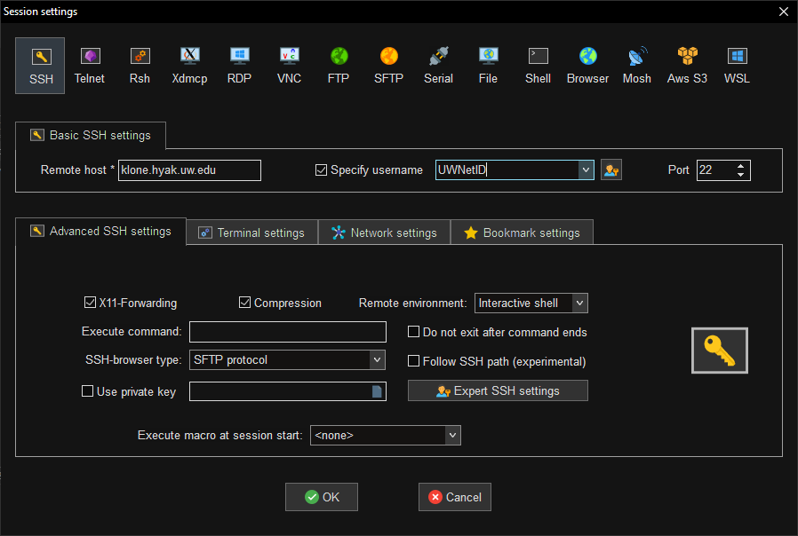
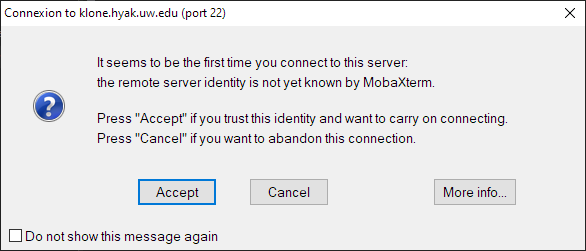

# SSH

SSH (secure shell) is the primary method for connecting to and interacting with UW HYAK clusters
from a command-line interface (CLI).

::::{important}
Connections to UW HYAK are authenticated with your UW NetID credentials and Duo for two-factor.
Alternative login methods, including SSH key authentication, cannot be used to login.

:::{tip}
Use an SSH client that supports session multiplexing/sharing to reuse an active session without
two-factor authentication.
:::
::::

## Installing an SSH client

:::{note}
macOS, most Linux distributions, and (newer builds of) Windows 10/11 already include **OpenSSH** client by default.
:::

Pick your platform and install an SSH client:

::::::{tab-set}
:::::{tab-item} Linux

Open a terminal and install OpenSSH client with your distribution's package
manager.

| Distribution | Command |
| ------------ | ------- |
| Ubuntu/Debian/Linux Mint | `sudo apt-get install openssh` |
| RHEL/CentOS/Fedora/Rocky | `sudo dnf install openssh` |
| SUSE | `sudo zypper install openssh` |
| Alpine | `apk add openssh` |
| Arch | `sudo pacman -S openssh` |

To setup session sharing, create a new host entry to **your local computer's** `~/.ssh/config`
with a text editor:

::::{card}
`~/.ssh/config`
^^^
```
Host klone.hyak.uw.edu
    HostName %h
    ControlPath ~/.ssh/%r@%h:%p
    ControlMaster auto
    ControlPersist 3600
```
::::
:::::

:::::{tab-item} macOS
macOS provides SSH commands by default and are accessible from command-line with
the native macOS Terminal application.

To setup session sharing, create a new host entry to **your local computer's** `~/.ssh/config`
with a text editor:

::::{card}
`~/.ssh/config`
^^^
```
Host klone.hyak.uw.edu
    HostName %h
    ControlPath ~/.ssh/%r@%h:%p
    ControlMaster auto
    ControlPersist 3600
```
::::
:::::

:::::{tab-item} Windows

There are many SSH clients available for the Windows platform. Here is a short table comparing
features provided by each SSH client:

::::{table} Feature Comparison of Windows SSH Clients
| SSH Client | Port-Forwarding | X11 | Session Sharing | Interface | File Transfer Interface |
| :--------- | --------------- | --- | --------------- | --------- | ----------------------- |
| [Win32-OpenSSH](https://learn.microsoft.com/en-us/windows-server/administration/openssh/openssh_install_firstuse?tabs=gui) | Supported | Requires X11 Server[^x11] | Unsupported | CLI | CLI |
| [MobaXterm](https://mobaxterm.mobatek.net/download-home-edition.html) | Supported | Supported | Unsupported | GUI/CLI | GUI/CLI |
| [PuTTY](https://www.chiark.greenend.org.uk/~sgtatham/putty/) | Supported | Requires X11 Server[^x11] | Supported | GUI | CLI |
| [MSYS2+OpenSSH](https://www.msys2.org/) | Supported | Requires X11 Server[^x11] | Unsupported | CLI | CLI |
| [WSL2+OpenSSH](https://learn.microsoft.com/en-us/windows/wsl/) | Supported | Supported | Supported | CLI | CLI |
::::

:::{note}
PuTTY's `plink.exe` tool is not suited for interactive sessions as it cannot handle many key inputs
(arrow keys for cursor movement, backspace for character deletion).
:::

:::{dropdown} Session Sharing in PuTTY
Check `Share SSH Connection if possible` in the **PuTTY Configuration** window under **Connection**->**SSH**:


Save a PuTTY profile under **Session** with the **hostname** set to `UWNetID@klone.hyak.uw.edu`:


While PuTTY maintains an active session with session sharing enabled, all (GUI/CLI) PuTTY tools can
reuse the active authenticated session **as long as the terminal window remains open and active**.
If all sessions close, authentication will be required.

To create a new terminal window, right click the title bar of an active terminal window, then click
on **Duplicate Session**.

To reuse an active session with CLI tools, specify the name of the saved PuTTY profile in place of
`UWNetID@klone.hyak.uw.edu`.
:::

:::::
::::::

## Connecting via SSH

::::::{tab-set}
:::::{tab-item} OpenSSH
1. Open a terminal instance.

:::{note}
Windows users should open PowerShell console, or install and use
[Windows Terminal](https://apps.microsoft.com/store/detail/windows-terminal/9N0DX20HK701)
from the Microsoft Store app.
:::

2. Connect to HYAK Klone cluster with `ssh` command with your UW NetID:

```bash
ssh UWNetID@klone.hyak.uw.edu
```

3. If prompted to "continue connecting", type 'yes' and press enter.

4. Login with your NetID password and authenticate with Duo.

If successful, the **login node**'s command prompt should appear.
:::::

:::::{tab-item} PuTTY
1. Open PuTTY:


2. Check **Share SSH Connection if possible** under **Connection**->**SSH**:


3. Under **Session**, set the **hostname** to `UWNetID@klone.hyak.uw.edu` and save the profile as
`Klone`:


4. Press **Open** at the bottom of the configuration window to start the connection.

5. Login with your NetID password and authenticate with Duo.

If successful, the **login node**'s command prompt should appear.
:::::

:::::{tab-item} MobaXterm GUI
1. Open MobaXterm:


2. Click the **Session** icon in the top left corner.

3. Select **SSH** under the **Session settings** window, then do the following:
- set the remote host to `klone.hyak.uw.edu`
- check **Specify username** and specify your UW NetID



4. Press **OK** at the bottom of the window to start the connection.

5. Press **Accept** if prompted to trust the identity of the remote host:



5. Login with your NetID password and authenticate with Duo.

If successful, the **login node**'s command prompt should appear.
:::::
::::::

## Transferring files to/from HYAK

:::{note}
Klone and Mox clusters have separate network attached storage. Copying to one cluster will not
copy to the other.
:::

::::::{tab-set}
:::::{tab-item} OpenSSH
`scp` is an OpenSSH client utility for copying files and directories to/from a remote target. The
general syntax has the following form:
```bash
scp [-r] <SOURCE_PATH> UWNetID@klone.hyak.uw.edu:<DESTINATION_PATH>
scp [-r] UWNetID@klone.hyak.uw.edu:<SOURCE_PATH> <DESTINATION_PATH>
```

:::{tip}
:::

To copy a file to Klone at some path, run:
```bash
scp /path/to/my/file UWNetID@klone.hyak.uw.edu:/gscratch/mylab/
```

To copy a file from Klone at some path, run:
:::::

:::::{tab-item} PuTTY CLI

`pscp` is a CLI utility (provided by a standard PuTTY installation) for copying files.

```
pscp [-r] <SOURCE_PATH> UWNetID@klone.hyak.uw.edu:<DESTINATION_PATH>
pscp [-r] UWNetID@klone.hyak.uw.edu:<SOURCE_PATH> <DESTINATION_PATH>
```

:::{note}
`pscp` does not support the use of the tilde (~) as a shortcut to the home directory. By default,
relative paths always start from home directory anyways.

```bash
# copy file to home directory
pscp.exe c:\path\to\my\file UWNetID@klone.hyak.uw.edu:
```
:::

:::{tip}
`pscp` can reuse/share an active SSH connection without re-authorization if using a saved PuTTY
profile with `Share SSH Connection if possible` enabled.
:::

To send a file to Klone at some path, run:
```bash
pscp.exe c:\path\to\my\file UWNetID@klone.hyak.uw.edu:/gscratch/mylab/
```

Alternatively, we can use the name of the saved PuTTY profile (`Klone` for this example) to reuse
an active connection to copy a file to Klone:
```bash
pscp.exe c:\path\to\my\file Klone:/gscratch/mylab/
```

To copy a directory to Klone, use the `-r` argument to copy directories and files recursively:
```bash
pscp.exe -r c:\path\to\my\directory\ Klone:/gscratch/mylab/
```
:::::

:::::{tab-item} WinSCP
TODO
:::::

:::::{tab-item} Cyberduck
TODO
:::::
::::::